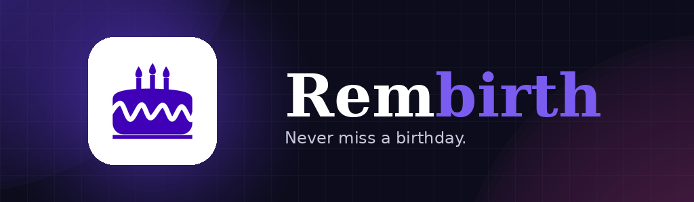
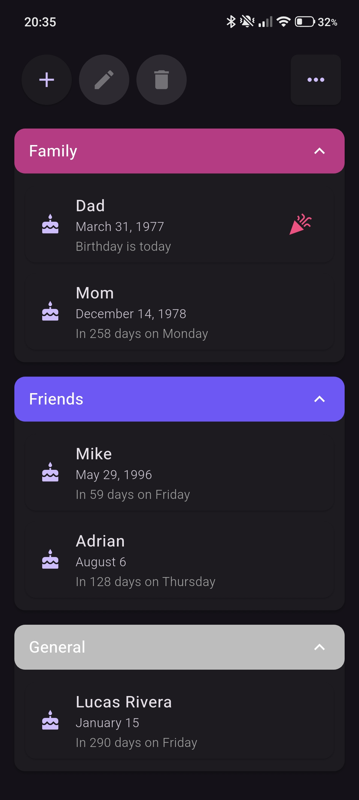
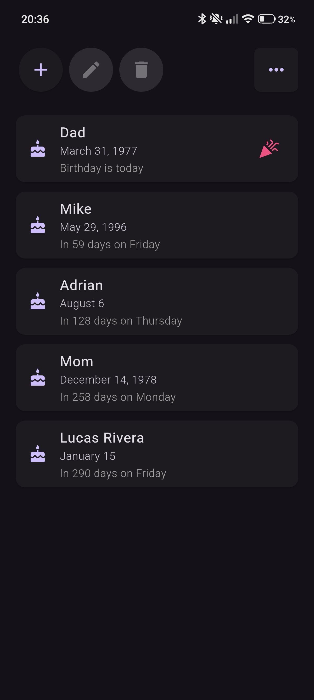
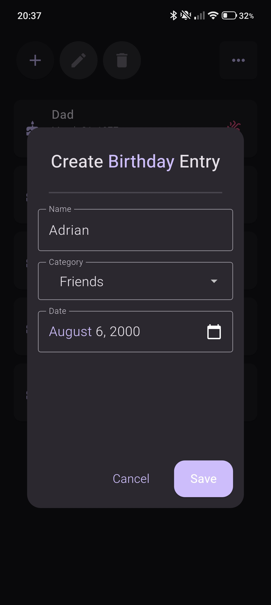
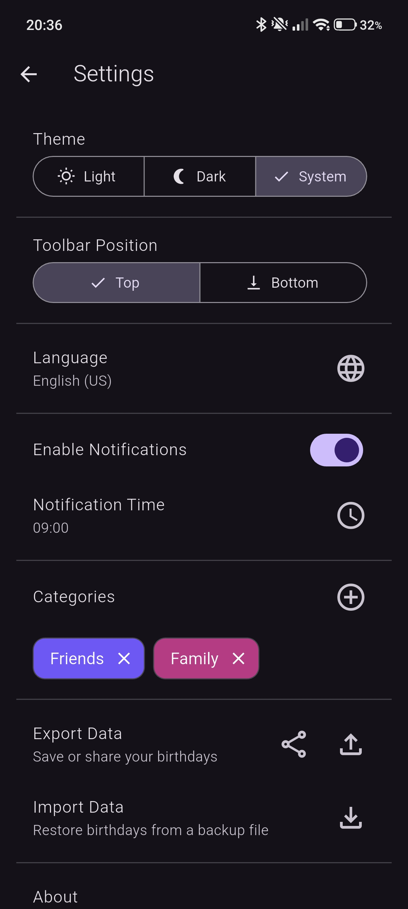

# Rembirth

    
      
    
    
    

---

[//]: # ([![GitHub Release]&#40;https://img.shields.io/github/v/release/solely-flerken/rembirth?label=Download%20APK&logo=android&#41;]&#40;https://github.com/solely-flerken/rembirth/releases/latest&#41;)

## Description

Never forget a birthday again. Rembirth lets you keep track of your friends' and family's birthdays in one simple place,
with reminders that actually show up when it matters.

---

## Screenshots

  
  
  
  

---

## Features

- **Birthday management:** Add, edit, and delete birthdays with a name, date (year is optional), and category
- **Categories:** Organize birthdays into custom categories with custom colors
- **Smart notifications:** Reminders at a time you choose, with background rescheduling
- **Backup & restore:** Export or share your data as JSON and import it back anytime
- **Themes:** Light, Dark, System
- **Languages:** English, German, Polish

---

## TODO
- ~~Localizations for notifications and new birthday entry creation form.~~
- ~~Create new categories through birthday entry creation form.~~
- Fix ghost entries which sometimes happen after deletion.
- Choose custom number of days for reminders.

---

## Privacy

This app stores all data locally on your device. No data is sent to any server.  
For more details, see the [Privacy Policy](https://solely-flerken.github.io/rembirth/privacy).

---

## Contribution & Development

Contributions to Rembirth are welcome! If you find any issues or have suggestions for new features,  
please open an issue or submit a pull request.

See [DEVELOPMENT.md](DEVELOPMENT.md) for build instructions, debug commands, and the release process.

---

## License

This project is licensed under [CC BY-NC 4.0](LICENSE).  
You may use, modify, and share it freely for non-commercial purposes, with attribution.